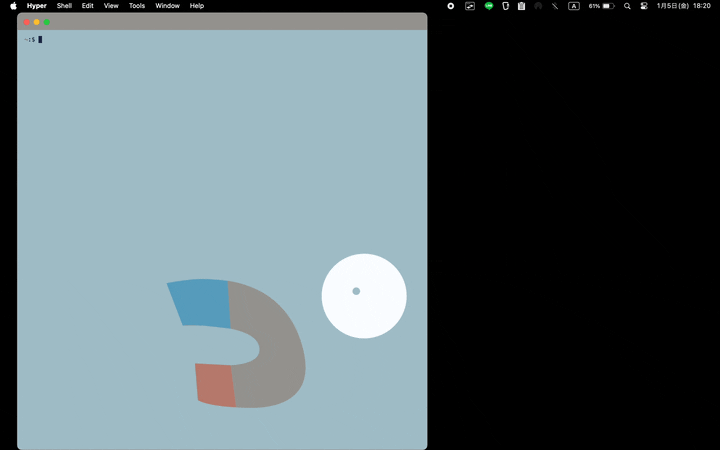

# og

An inverted [The Go Gopher (gopher)](https://go.dev/blog/gopher) falls from the sky.



## Install

```bash
$ git clone https://github.com/hamao0820/og.git
$ cd og
$ CGO_ENABLED=1 go build ./...
```

## Usage

```bash
og
```

## License

images/\*.png are designed by [tenntenn](https://tenntenn.dev/).

images repository:
https://github.com/tenntenn/gopher-stickers

The Go gopher was designed by Renee French. (http://reneefrench.blogspot.com/)
The design is licensed under the Creative Commons 3.0 Attributions license.
Read this article for more details: https://go.dev/blog/gopher

```

```
